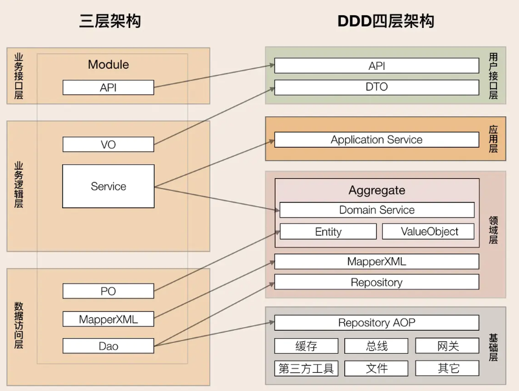
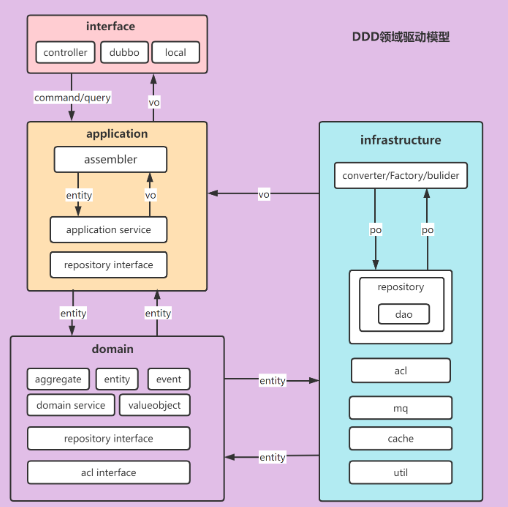
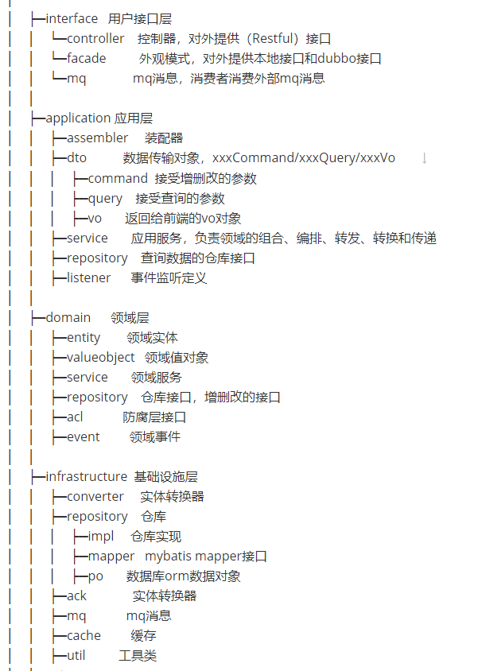

#  这个项目是干什么的
- 提供单体spring-boot脚手架，进行快速开发。对于每次新建项目时，建包、日志、日志格式文件、数据库配置等等...通用功能的搭建太耽误我们的时间。使用的时候将他拉取下来修改文件夹名字，就搭建好了基础框架。
- 其实这个仓库更像是一个web项目，但是没有业务在其中。拉取本项目到本地打开其中有样例说明

## 目前已提供

1. 通用异常[CommonException.java](./src/main/java/com/template/exception/CommonException.java)
2. 统一异常返回[ExceptionController.java](application/src/main/java/com/xxl/controller/exception/ExceptionController.java)
3. 接口，异常日志记录[ApiLog.java](./src/main/java/com/template/core/log/ApiLog.java)
4. redis工具类[RedisConfig.java](application/src/main/java/com/xxl/scaffold/config/RedisConfig.java)
5. redis序列化[RedisUtils.java](application/src/main/java/com/xxl/scaffold/toolkit/redis/RedisUtils.java)
6. 统一响应[RespEntity.java](./src/main/java/com/template/core/resp/RespEntity.java)
7. 断言封装类[AssertUtils.java](./src/main/java/com/template/core/utils/AssertUtils.java)
8. 通用分页请求工具类[CommonPageRequestUtils.java](./src/main/java/com/template/core/utils/CommonPageRequestUtils.java)
9. 文件下载上传类[FileUtils.java](./src/main/java/com/template/core/utils/FileUtils.java)
10. SpringMvc相关的配置[SpringMvcWebConfig.java](./src/main/java/com/template/core/web/SpringMvcWebConfig.java)

## 目前已集成的依赖

### spring-boot帮我们做版本依赖

1. `spring-boot-starter-web`:servlet 
2. `spring-boot-starter-aop`:aop编程
3. `spring-boot-starter-test`:模块测试
4. `spring-boot-starter-validation`:参数校验
5. `spring-boot-starter-data-redis`:redis集成
6. `mysql-connector-j`:MySQL驱动
7. `spring-boot-starter-jdbc`:基于MySQL驱动提供jdbc简单编程
8. `lombok`:get/set方法

### 需要去官网/仓库去看版本信息

1. `hutool-all`:java语法糖
2. `knife4j-openapi3-jakarta-spring-boot-starter`:基于swagger的接口测试框架
3. `mybatis-plus-boot-starter`:用代码写SQL

## 启动类说明

1. 项目中能使用并带有`Enable`的注解都已经加上

## 包介绍
- **文件存放请按图说明来**

- **传统的MVC开发到后面会发现，项目越来越臃肿，所以包结构采用DDD开发模式。详细内容见下图**

- ##### 实际DDD是一种思想`就是软件的领域开发，一个“原子”领域就是一种不开拆分业务的昵称,可以称之为业务开发`，传统的MVC以数据为基础。所以采用DDD开发模式，包结构需要有所变化，但是没有标准的命名，下面是简化版
- ##### 开发流程：如果根据DDD思想详细流程见下图，传统的`controller <-- service <-- dao`,service层太广泛所以采用domain的领域思想，更具业务创建service

```text
./
└── main
    ├── java
    │   └── com
    │       └── template
    │           ├── Application.java
    │           ├── config
    │           ├── controller
    │           │   ├── exception
    │           ├── core 脚手架提供的东西都在这里面
    │           │   ├── log  日志监控包
    │           │   ├── redis  redis相关
    │           │   ├── resp  同意响应包
    │           │   ├── utils  工具包如下载
    │           │   └── web web相关包
    │           ├── domain  业务层
    │           ├── exception  异常包
    │           ├── filter 过滤器
    │           ├── interceptor 拦截器
    │           ├── repository  dto层
    │           └── utils 工具包
    └── resources
        ├── application-dev.yml  数据库配置
        ├── application.yml  通用yml配置
        ├── logback-spring.xml  logback日志样式
```

## DDD开发模式

- 具体内容可以见[DDD领域驱动设计](https://blog.csdn.net/qq_41889508/article/details/124907312)
  1. **MVC的开发模式**：是数据驱动，自低向上的思想，关注数据。
  2. **DDD的开发模式**：是领域驱动，自顶向下，关注业务活动。

**MVC VS DDD**



## CQRS实战

- CQRS(Command Query Responsibility Segregation)是将Command(命令)与Query(查询)分离的一种模式。其基本思想在于：任何一个方法都可以拆分为命令和查询两部分：
- Command：不返回任何结果(void)，但会改变对象的状态。Command是引起数据变化操作的总称，一般会执行某个动作，如：新增，更新，删除等操作。操作都封装在Command中，用户提交Commond到CommandBus，然后分发到对应的CommandHandler中执行。Command执行后通过Repository将数据持久化。事件源(Event source)CQRS，Command将特定的Event发送到EventBus，然后由特定的EventHandler处理。
- Query：返回查询结果，不会对数据产生变化的操作，只是按照某些条件查找数据。基于Query条件，返回查询结果；为不同的场景定制不同的Facade。

**DDD开发流程**



**标准包结构：借鉴。**


